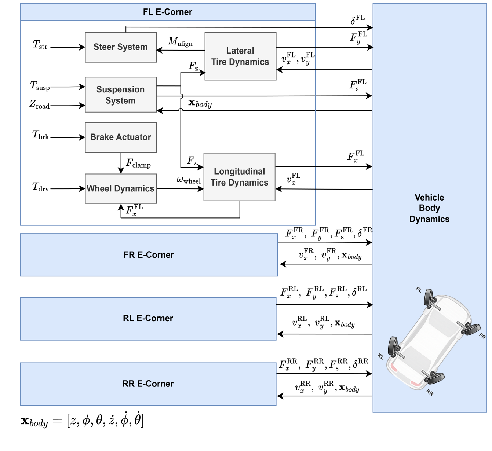

# vehicle_sim

E-Corner 차량 동역학 시뮬레이션 패키지.

---

## 시스템 구조



각 E-Corner는 독립적으로 동작하며, 4개 코너의 힘과 모멘트를 VehicleBody가 통합한다.

---

## 구성요소 입출력 요약

| 그룹 | 구성요소 | 입력 | 상태 | 출력 |
|---|---|---|---|---|
| Actuation | Brake Actuator | `T_brk` | `F*_clamp` | `F_clamp` |
| Actuation | Drive System | `T_drv`, `F_clamp` | `ω` | `ω` |
| Actuation | Steer System | `T_str`, `T_align` | `δ`, `δ̇` | `δ` |
| Suspension | Suspension System | `T_susp`, `z_road` | `z_u`, `ż_u` | `F_s`, `F_z` |
| Tire models | Longitudinal Tire Dynamics | `ω`, `V_wx`, `F_z` | — | `F_x` |
| Tire models | Lateral Tire Dynamics | `V_wx`, `V_wy`, `F_z` | — | `F_y`, `M_z` |
| Vehicle body | Vehicle Body Dynamics | `F_x`, `F_y`, `F_s`, `δ` | `X_body` | `X_body`, `V_wx`, `V_wy` |

차체 상태 벡터: `X_body = [z, φ, θ, ż, φ̇, θ̇]`

---

## 패키지 구조

```text
vehicle_sim/
└── models/
    ├── params/
    │   └── vehicle_standard.yaml                          # 공용 파라미터
    ├── vehicle_body/
    │   ├── vehicle_body.py                                # 전체 차량 바디 모델
    │   └── test_debug/
    │       └── full_vehicle_body_test.ipynb                # 전체 차량 시뮬레이션 테스트
    └── e_corner/
        ├── e_corner.py                                    # 코너 통합 모델
        ├── test_debug/
        │   └── e_corner_model_test.ipynb                  # E-Corner 통합 테스트
        ├── steering/
        │   ├── steering_model.py
        │   ├── test_debug/
        │   │   └── steering_model_test.ipynb              # 조향 모델 테스트
        │   └── test_viz/
        │       └── steering_model_viz.ipynb               # 조향 모델 시각화
        ├── drive/
        │   ├── drive_model.py
        │   ├── brake_model.py
        │   └── test_debug/
        │       ├── drive_model_test.ipynb                 # 구동 모델 테스트
        │       └── brake_model_test.ipynb                 # 제동 모델 테스트
        ├── suspension/
        │   ├── suspension_model.py
        │   └── test_debug/
        │       └── suspension_model_test.ipynb            # 서스펜션 모델 테스트
        └── tire/
            ├── longitudinal/
            │   ├── longitudinal_tire.py
            │   └── test_debug/
            │       └── longitudinal_tire_test.ipynb       # 종방향 타이어 테스트
            └── lateral/
                ├── lateral_tire.py
                └── test_debug/
                    └── lateral_tire_test.ipynb            # 횡방향 타이어 테스트
```

---

## models

### E-Corner

코너 단위 통합 모델. 조향 → 구동/제동 → 서스펜션 → 타이어 순서로 업데이트.

| 서브모델 | 파일 | 역할 |
|---|---|---|
| SteeringModel | `steering/steering_model.py` | 조향 토크 → 조향각 |
| DriveModel | `drive/drive_model.py` | 구동 토크 → 휠 각속도 |
| BrakeModel | `drive/brake_model.py` | 제동 토크 → 클램핑력 |
| SuspensionModel | `suspension/suspension_model.py` | 차체 자세 → 수직력 |
| LongitudinalTireModel | `tire/longitudinal/longitudinal_tire.py` | 슬립률 → 종방향 힘 |
| LateralTireModel | `tire/lateral/lateral_tire.py` | 슬립각 → 횡방향 힘 |

```python
from vehicle_sim import ECorner

corner = ECorner(corner_id="FL")
corner.update(dt=0.001, T_steer=0.0, T_brk=0.0, T_Drv=0.0,
              T_susp=0.0, X_body=X_body, z_road=0.0)
```

### VehicleBody

4개 E-Corner + 차체 6자유도 동역학을 통합한 전체 차량 모델.

```python
from vehicle_sim import VehicleBody

vehicle = VehicleBody()

# 코너별 액추에이터 입력 정의
corner_inputs = {
    "FL": {"T_steer": 0.0, "T_brk": 0.0, "T_Drv": 10.0, "T_susp": 0.0, "z_road": 0.0},
    "FR": {"T_steer": 0.0, "T_brk": 0.0, "T_Drv": 10.0, "T_susp": 0.0, "z_road": 0.0},
    "RL": {"T_steer": 0.0, "T_brk": 0.0, "T_Drv": 10.0, "T_susp": 0.0, "z_road": 0.0},
    "RR": {"T_steer": 0.0, "T_brk": 0.0, "T_Drv": 10.0, "T_susp": 0.0, "z_road": 0.0},
}

vehicle.update(dt=0.001, corner_inputs=corner_inputs)

# 차체 상태 조회
state = vehicle.state  # VehicleBodyState (x, y, heave, roll, pitch, yaw, ...)
```

### 파라미터 (`vehicle_standard.yaml`)

모든 서브모델이 공유하는 차량 관련 파라미터 파일.
